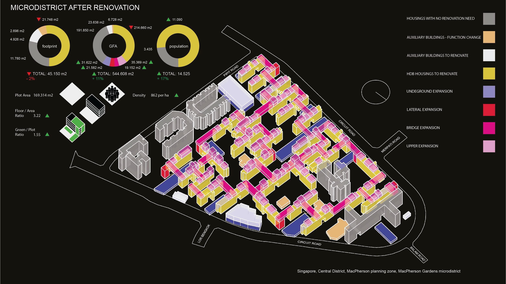

# Recycling_Concrete_of_Singapore
## Research of urban mining and strategy of the circular construction industry for Singapore.  
team: Reda Petravičiūtė, Naohiro Miyaguchi, Roman Pomazan 
[IAAC blog link](https://blog.iaac.net/urban-mining-in-the-city-of-pre-cast-concrete/) 
The project strategically targets public housing as a place of densification and a source of urban mining, aiming to solve the problem of upcoming precast concrete waste. Therefore a circular micro-district design proposal is created, focusing on processes (new circular hubs, proximity of material distribution), materials (pre-cast modules with upcycled materials) and environment (bioclimatic conditions improvement), applied both in district and city scale.  
tools: Grasshopper (Rhinoceros 3d 7), Hops, EarthEngine, Geojson, Json, Scikit-learn, QGIS, illustrator, Photoshop, Urbano, Wallacey, Shrimp, Decoding Spaces.

## Questions
- what are strategic objectives of Singapore as a state to sustain the high-competitive economy in the future?
- how strategic objectives correlate with current construction cycle policies and goals of non-carbon future?
- what could be changed in the policy-making of Singapore to meet the GLobal goals of circular economy?

## What I learned: 
- Data mining with Earth Engine, Json and OSMNX.
- Openstreetmap dat about buildings is not sufficient and biased, thus in order to make a reliable dataset we have to clean and enrich OSM data with data from official sources or ML recognized polygons from satellite images, 
- Data cleaning and preparation.
- Data creation with Scikit-learn.
- Data vizualisation for analysis.
- Generation of scenarios of neighborhood renovation applying the evolutional ML of Wallacey.
- Methods of overlappind map data with Grasshopper and QGIS.
- Methodology-development of scientific research project.
- Map generation with Networkx, OSMNX, Geopandas.
- Processing of complex-layered maps.
- Merging BIM and GIS to ETL

## Key takeaways
- Singapore resolves the housing issue by a unique approach of maintaining the Lion's part of public-funded residences that are leased for 100 years.
- Dominating part of construction materials consists of different states of concrete.
- Constant densification leads to material waste.
- Singapore is one of the main hubs of concrete processing in Asia i.e. importer of concrete aggregates, and the main innovation hub for reused concrete upcycling.
- In 2022 Singapore is downcycling 99% of concrete, nevetheless it is just a tiny share of imported concrete, thus the concrete waste issue is gradually aggregated.
- In 40-60 years the majority of Singapore concrete housings will meet the challenge of the outdated level of zero-carbon embedded emissions.
- Singapore develops and implements several schemes for the updating energy-efficiency of housings.

## Data visualization
### Singapore map of built landscape.

### Timeline of the Singapore's urban growth.

### Methodology for identification of typologies of buildings.

### Mapping distribution of building typologies.

### Mapping distribution of building typologies. Heritage lowrise residences.

### BIM models of main typologies. Calculation of material share.

### Distribution of materials in buildings. Machine learning prediction.

### Distribution of lease end in residential blocks, future urban mining sites. Machine learning prediction of ready-to-recycle concrete.

### Map of future development zones showing the urban densification.

### Map of reserved land sites for the urban densification.

### Strategy map of the recycling densification.

### Map of proposed blocks for the recycling densification. 2023-2025

### Map of future development zones that adopt the recycling densification. 2025-2030

### Map of future development zones that adopt the recycling densification. 2030-2035

### Map of future development zones that adopt the recycling densification.2035-2040

### Map of clustered blocks for the intervention of the circular construction.

### Map of the selected microdistrict for the recycling densification.

### BIM Axonometry of the selected microdistrict before renovation.

### Scheme of objectives for the recycling densification on the example of microdistrict renovation.

### Modularity scheme of the recycling densification.

### Scheme of material flow in building scale. BIM

### Scheme of material flow in residential unit scale. BIM

### Scheme of material collection and recycling facilities of the pilot project. BIM

### Scheme of undeground expansion within the pilot project. BIM

### Scheme of volume extraction within the pilot project. BIM

### Scheme of facade renovation within the pilot project. BIM

### Scheme of lateral expansions of buildings within the pilot project. BIM

### Scheme of bridge expansions between buildings within the pilot project. BIM

### Scheme of upper expansions of buildings within the pilot project. BIM

### BIM Axonometry of the selected microdistrict after renovation.

### BIM Axonometry of the selected microdistrict with proposed application of nature-based solutions.

### BIM Axonometry of the selected microdistrict with differentiation of mixed use.

### BIM Axonometry of the selected microdistrict with proposed application of nature-based solutions.

## Strategy proposal
To identify the materials contained within public housing and their distribution, we utilized a rule-based algorithm alongside a facade recognition tool. This approach enabled us to categorize 12 material sub-typologies within buildings, revealing that the predominant typology is the residential high-rise, which accounts for more than half of the total typologies' gross floor area (GFA) in Singapore. Through assigning percentages to each building type, we found that pre-cast concrete and concrete are the most common materials. Our analysis further highlighted that public housing has the highest concentration of pre-cast concrete, underscoring its importance as an urban mine.

Singapore requires a more circular approach to densification, leveraging existing public housing as sources of materials and for densification efforts. Our proposal includes three main elements: a densification strategy, policy considerations, and a design proposal focused on the concept of circular micro-districts. The initial question addresses how Singapore can transition from linear urbanization to utilizing empty zones. Our findings suggest that there is no need to develop on reserved land sites; instead, densification should concentrate on regenerating the existing housing stock in a circular manner, thus avoiding significant pre-cast waste. The map illustrates the current GFA of public housing in violet. By densifying future development sites (indicated in brown), we can achieve only half of the maximum potential GFA for public housing (shown in white), accommodating an influx of 1.4 million people.

To unlock the potential for strategic renovation, we must consider how to minimize material waste in densification processes and how to upcycle concrete. For the areas mentioned earlier, we propose applying the concept of circular micro-districts, which are implemented at both city and district scales. These districts are identified as existing public housing areas of various sizes that have reached a 50-year lifespan, although the principles can also be applied to new developments.

In 2017, Singapore launched the Construction Industry Transformation Map, which aims to broadly adopt Design for Manufacturing and Assembly (DfMA) and introduce mass modular construction. To enhance the existing policy, we suggest focusing on modularity as a crucial aspect of circular construction in the future. Modularity incorporates DfMA along with Design to Robotic Production and Assembly, offering a framework for customizable prefabricated modules that integrate five dimensions: a variety of 3D geometry, materials, and nature-based solutions.

The material flow of prefabricated modules is demonstrated in a case study, where existing building materials were categorized into four groups: "recycle," "retrofit," "reuse," and "demolish." To improve building quality, new materials such as hempcrete and Cross-Laminated Timber (CLT) were introduced to reduce CO2 emissions. The project also presents potential scenarios for material upcycling in flats.

Circular micro-districts will be applied across all micro-districts in Singapore, enabling a shift towards acupuncture renovation, contribute to a new generation of the Green Mark Standard with a strong emphasis on reuse and recycling, incentivize the Urban Mining Futures Market, and support the transition to a circular economy. Additionally, they will aid in refining concrete upcycling and its replacement with nature-based materials, helping to make the circular economy a ubiquitous practice and changing the traditional concept of 'business as usual'.

##  References
- Urban mining. Scoping resources for circular construction. Areti Markopoulou, Oana Taut, Hesham Shawqy  [Link](https://link.springer.com/article/10.1007/s44223-023-00021-4)
- Green Strategy Singapore 2030.A comprehensive plan aimed at enhancing green spaces and biodiversity across Singapore.[NParks](https://www.nparks.gov.sg)
- Zero Waste Masterplan. Singapore's roadmap towards achieving a sustainable, resource-efficient future with zero waste.[NEA](https://www.nea.gov.sg)
- Masterplan Singapore 2019. [Urban Redevelopment Authority (URA) Singapore Maps](https://www.ura.gov.sg/maps)
- [Singastat](https://www.singstat.gov.sg/)
- [Data.gov.sg](https://data.gov.sg/)
- [OpenStreetMap](https://www.openstreetmap.org/)
- [Building and Construction Authority (BCA) Singapore](https://www1.bca.gov.sg)
- [Housing & Development Board (HDB) Singapore](https://www.hdb.gov.sg/)
- ISPRS Annals of Photogrammetry, Remote Sensing and Spatial Information Sciences. F. Biljecki. Exploration of open data in Southeast Asia to generate 3D building models. [VI-4/W1-2020](https://isprs-annals.copernicus.org/articles/VI-4-W1-2020/37/2020/)
- Areti Markopoulou. Responsive City Proceedings
- Xining Yang, Mingming Hu, Chunbo Zhang, Bernhard Steubing. [Journal of Cleaner Production](https://doi.org/10.1016/j.resconrec.2022.106215)
- [Circular Prague](https://klima.praha.eu/en/circular-economy.html)
- [Circle Economy](https://www.circle-economy.com/)
- Schoonschip Amsterdam. [Greenprint](https://greenprint.schoonschipamsterdam.org/)  
- [Metabolic Publications](https://www.metabolic.nl/publications/cleantech-playground/)
- Taisugar Circular Village. [BioArch](https://www.bioarch.com.tw/work/taisugar-s-circular-village)
- Second Life Machine Learning Classification of Reuse Materials. [IAAC Blog](https://www.iaacblog.com/programs/second-life-aia/)
- F. Biljecki[ISPRS Annals](https://doi.org/10.5194/isprs-annals-VI-4-W1-2020-37-2020)  
- Dirk E. Hebel and Felix Heisel. Fraunhofer IRB Verlag
